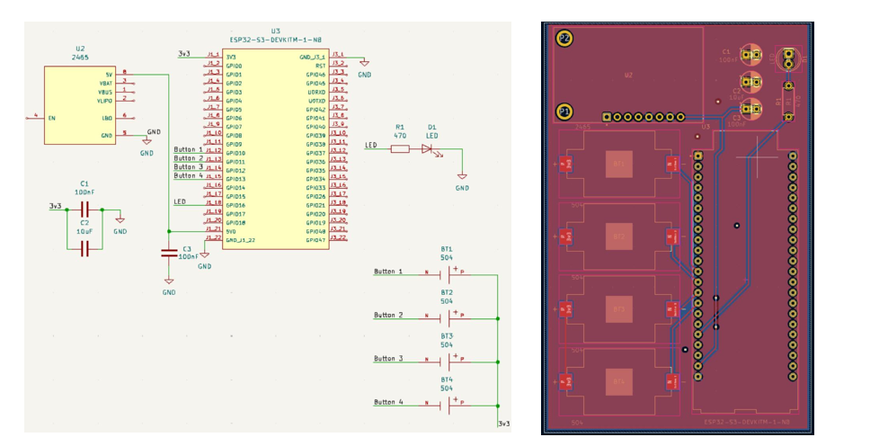
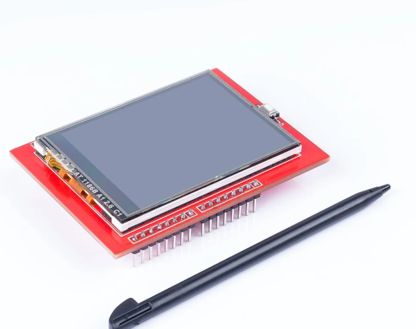

# Xiaohu Worklog 
- [Xiaohu Worklog](#Xiaohu-worklog)
- [2025-02-17-Discussion with Professor Fliflet](##2025-02-17-Discussion-with-Professor-Fliflet)
- [2025-02-27-PCB Update](##2025-02-27-PCB-Update)
- [2025-03-03-Initial Design on Breadboard](2025-03-03-Initial-Design-on-Breadboard)
- [2025-03-17-Working on the YOLOV5 model](2025-03-17-Working-on-the-YOLOV5-model)
---
## 2025-02-17-Discussion with Professor Fliflet
During the proposal review, Professor Fliflet provided suggestions for implementing the ideas we outlined. We decided to use the YOLOv5 model as our baseline to recognize and classify tools across various categories. We plan to train the model on our laptop before deploying it to a Raspberry Pi. Additionally, we will use an LCD screen to display item statuses on both the bench and in the drawer.
## 2025-02-27-PCB Update
We came up with an initial PCB design that includes the STM32 microcontroller, an LED, and a buzzer.

## 2025-03-03-Initial Design on Breadboard
For our breadboard demonstration, we attempted to connect the LCD screen to the STM32 microcontroller, but it did not function as expected. Additionally, the STM32 failed to transmit data reliably to the laptop.

## 2025-03-17-Working on the YOLOV5 model
I trained a YOLOv5 model to recognize tools across different categories, using a dataset from [Kaggle](https://www.kaggle.com/datasets/vdeshmukh18/segmented-screw-driver-dataset). Initially, I trained the model on approximately 200 images per category. However, when I use the model to detect screwdrivers, it takes a long time to recognize the item.
